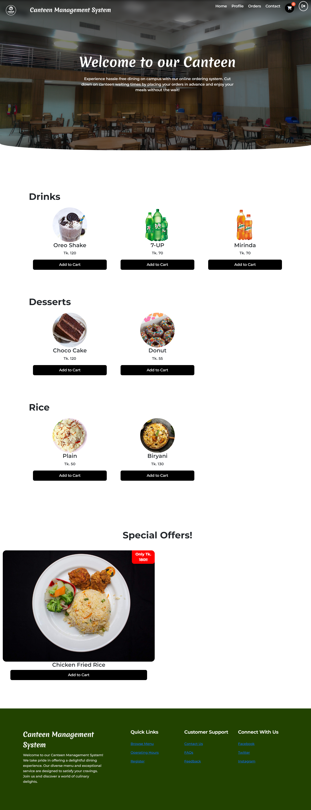
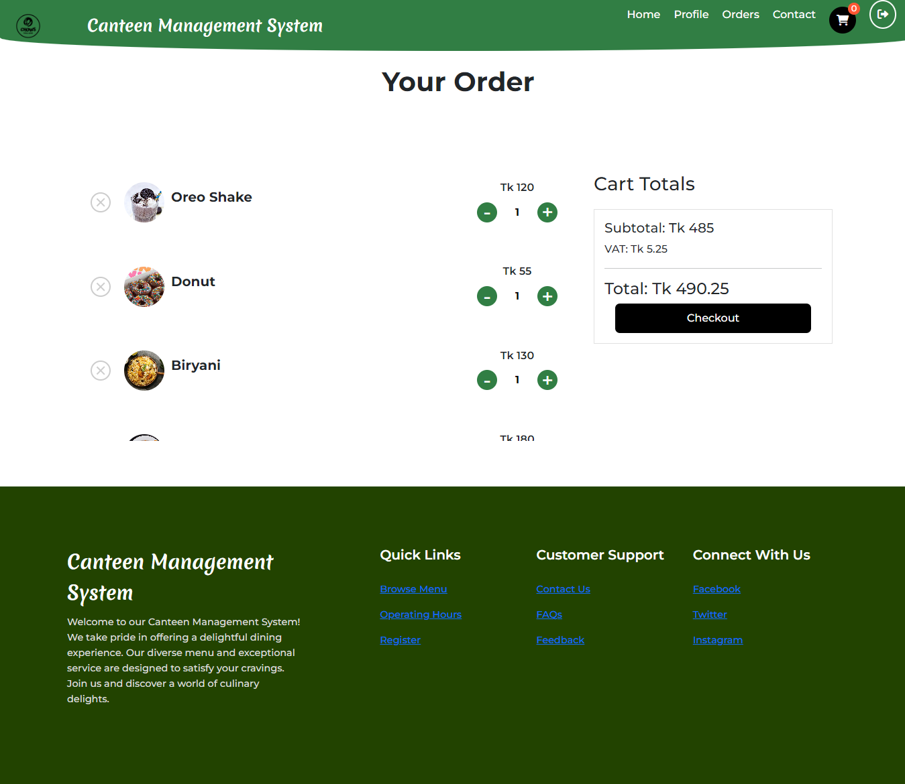
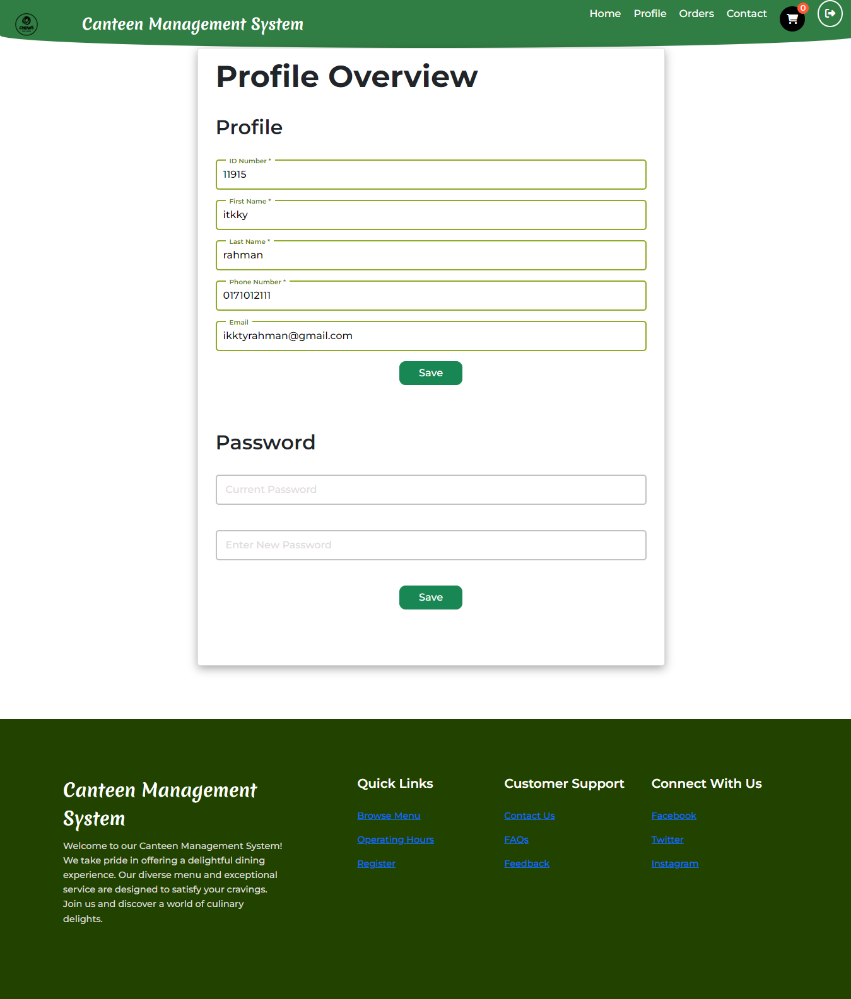

# Canteen Management System 🍽️

A comprehensive web-based food ordering system designed to streamline operations at university canteens, built with PHP, MySQL, JavaScript, HTML, and CSS.

## 🚀 Features

- **User Authentication & Profiles**: Secure login system with profile management
- **Interactive Menu System**: Browse available food items with real-time updates
- **Shopping Cart**: Add/remove items with instant cart updates
- **Order Management**: Place and track food orders
- **Password Security**: Current password verification for password changes
- **Responsive Design**: Works seamlessly across desktop and mobile devices


## 📸 Screenshots

### Main Menu & Ordering Interface

*Browse menu items organized by categories with easy "Add to Cart" functionality*

### Shopping Cart System

*Real-time cart updates with quantity controls, pricing, and VAT calculations*

### User Profile Management

*Comprehensive profile editing with secure password change functionality*


## 🛠️ Technologies Used

- **Frontend**: HTML5, CSS3, JavaScript
- **Backend**: PHP
- **Database**: MySQL


## 📋 Prerequisites

Before running this project, make sure you have:

- PHP 7.4 or higher
- MySQL 5.7 or higher
- Apache/Nginx web server
- Web browser (Chrome, Firefox, Safari, etc.)

## ⚡ Installation & Setup

1. **Clone the repository**
   ```bash
   git clone https://github.com/eter-null/WebApp-Canteen-Management.git
   cd WebApp-Canteen-Management
   ```

2. **Set up the database**
   - The database and tables are created automatically when you first run the application


3. **Configure database connection**
   ```php
   // Update php/connect.php and db_conn.php with your credentials
    $HOSTNAME='localhost';
    $USERNAME='root';
    $PASSWORD='';
    $DATABASE='cms';
   ```

4. **Start your web server**
   - Place project folder in your web server directory (htdocs for XAMPP)
   - Access via `http://localhost/WebApp-Canteen-Management/index.html`

## 📱 Usage


1. **Register/Login** to create your account
2. **Browse Menu** to see available food items
3. **Add to Cart** items you want to order
4. **Place Order** and receive confirmation
5. **Manage Profile** including password changes


## 🏗️ Project Structure

```
WebApp-Canteen-Management/
├── php/                    # Backend PHP scripts
│   ├── cart-to-orders-insert.php
│   ├── check-password.php
│   ├── connect.php         # Database connection
│   ├── contact-insert.php
│   ├── get-customer-info.php
│   ├── orders-display.php
│   ├── update-cart-items.php
│   └── update-profile.php
├── script/                 # JavaScript files
│   ├── cartButton.js
│   ├── cartScript.js
│   ├── delcartScript.js
│   └── headerChange.js
├── stylesheet/             # CSS styling
│   ├── cartStyle.css
│   ├── contactStyle.css
│   ├── footer.css
│   ├── header.css
│   ├── homeStyle.css
│   ├── loginStyle.css
│   ├── ordersStyle.css
│   ├── profileStyle.css
│   └── style.css
├── test/                   # Testing files
│   ├── add_to_cart.php
│   ├── get_cart_contents.php
│   ├── script.js
│   ├── style.css
│   └── testjs.html
├── add_to_cart.php         # Cart functionality
├── cart.php               # Shopping cart page
├── contactus.php          # Contact page
├── db_conn.php           # Database connection
├── home.php              # Main home page
├── index.html            # Landing page
├── login.php             # User authentication
├── logout.php            # Logout functionality
├── menu.php              # Food menu display
├── orders.php            # Order management
├── profile.php           # User profile page
├── README.md             # Project documentation
├── remove_from_database.php
└── remove_from_cart.php  # Cart item removal
```

## 🎯 Key Challenges Solved

- **Real-time Cart Updates**: Implemented AJAX for seamless cart management without page reloads
- **Security**: Input validation and SQL injection prevention
- **User Experience**: Intuitive interface design for quick food ordering
- **Password Security**: Implemented current password verification for account changes


